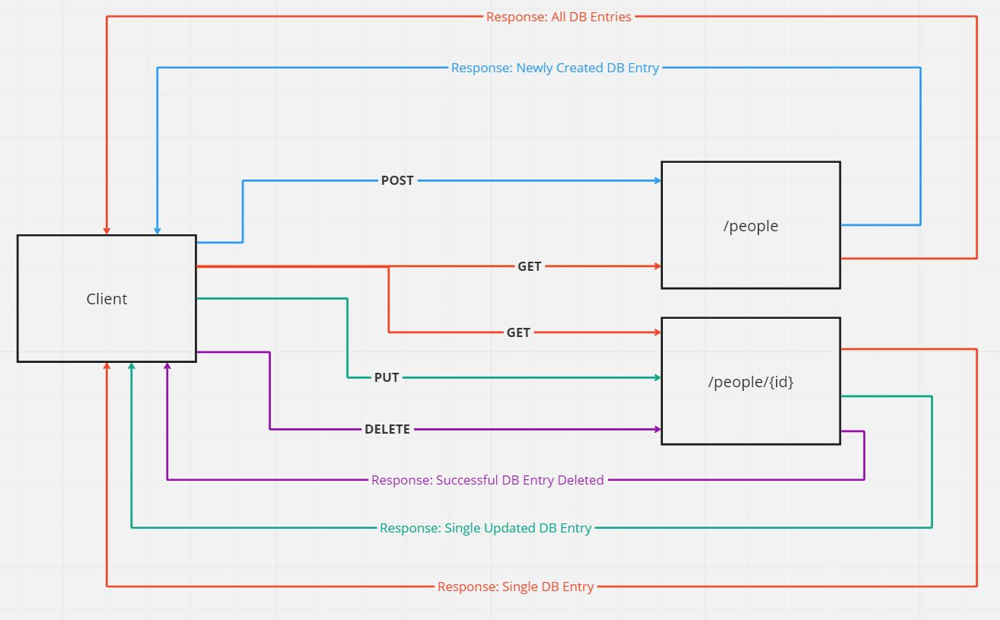

# serverless-api

Root URL: https://lxbj8glc81.execute-api.us-west-2.amazonaws.com/Lab18

Routes: `/people` or `/people/{id}` where `{id}` is the id of an entry within the database

Inputs: `{db}` will need to be filled in depending on the request being made

Output: JSON file(s) with data from the DynamoDB

## UML

